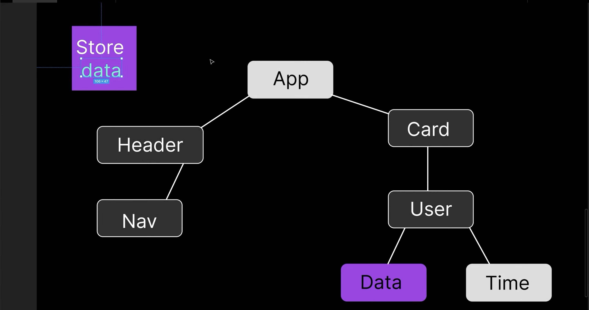
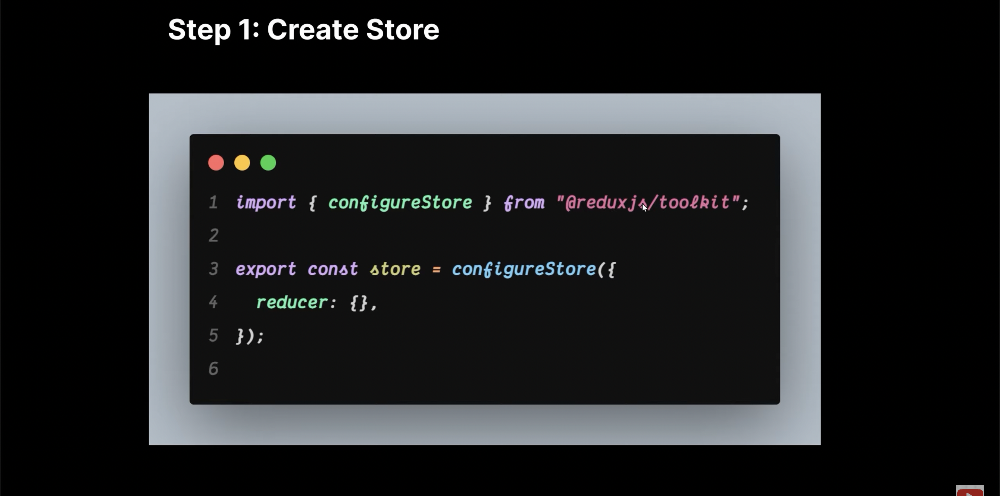
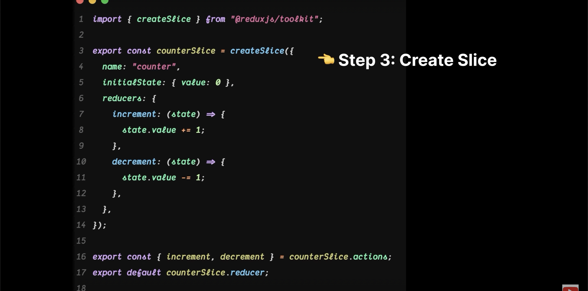
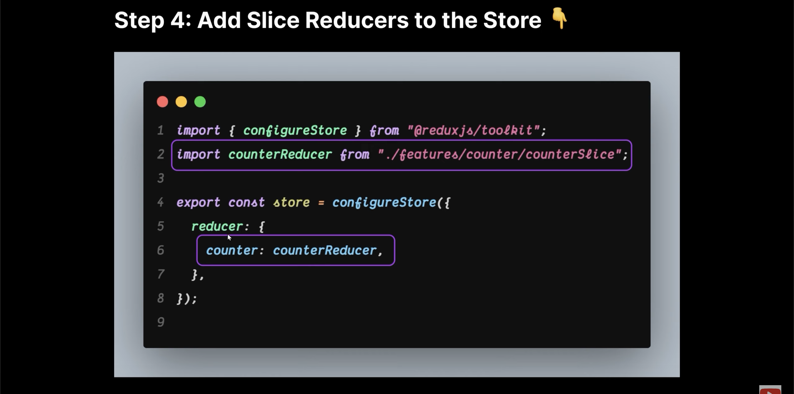

# Redux Toolkit

- Redux is an open-source Javascript library for managing the store of an application
in a predictable way.
- It is commonly used with libraries like React for building user interfaces but can be
used any javascript library or framework.

## Toolkit 
- The official, opinionated, batteries-included toolset for efficient Redux development.

- Make the state management Easy.
- makes the Redux easy to work with

# What is Store ?
- A Store is a centeral place where the state of our application is stored and it can be
created using the "_configureStore_"  function, and it holds the entire state tree of our application.

* Create A Store

# What is Slice ?
- A slice is a peace of store state and the corresponding reducer logic to update that state. Slice are a way to organize our Redux store by breaking it down into smaller, more manageable parts.

# Slice Analogy
- Imagine you have a big cake, and you want to cut it into smaller, more manageble pices. Each smaller piece is like a 'slice' of the cake. In the context redux toolkit a 'slice' is like a smaller part of your application's overall state and the instruction on how to change or update that specific part.

* initialState as the name suggest is going to be the 'initial' data of our state.

* Reducers :: Reducers are like the instructions on what to do with each slice of the cake.
* They define how the information in a purticular slice can be changed or updated.

* Actions :: Actions are like the requests or commands you give to change a specific slice of the cake
* For Example, you might have an action called "Eat a Bite" that instucts how to take a bite from slice.

# Adding Slice Reducer to the Store

* useSelector() Hook
- useSelector hook allows us to read data from the redux store.
- In simple terms, it lets you change the state in your Redux store from within your React components.

# Redux Toolkit Query 
- Redux Toolkit Query (RTK) is is specifically designed to simplify ___data fetching__, caching and state management for API calls in React & Redux Application.

# What we'll learn ?
* How to get All Products
* How to get a Specific Product
* How to add a new Product 
* How to update a Product 
* How to delete a Product

 

